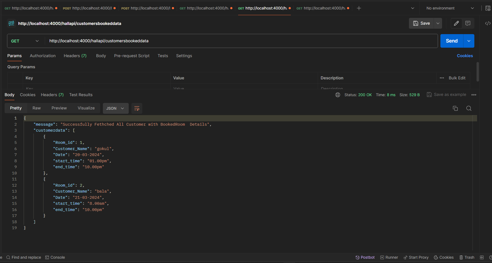

# Node-js Hall Booking Task

## Welcome to the greate karigalan Hall Booking System

This is an Express.js application for managing bookings and rooms at the greate karigalan Hall Booking System.

## Table of Contents

- [Usage](#usage)
- [Endpoints](#endpoints)
- [Data Structures](#data-structures)
- [Demo](#demo)

## Endpoints

### GET /

- **Description:** Returns a welcome message and instructions on how to use the API.
  

### GET /hallapi/allroomdetails

- **Description:** Retrieves details of all available rooms.
  


### POST /hallapi/createroom

- **Description:** Creates a new room.


### POST /hallapi/bookingroom

- **Description:** Books a room for a customer.


### GET /hallapi/bookedroomdata

- **Description:** Retrieves data of all booked rooms.


### GET /hallapi/customersbookeddata

- **Description:** Retrieves data of all customers with booked room details.



### GET /hallapi/customerbookingcount

- **Description:** Retrieves booking details for each customer along with booking count.


## Data Structures

### Room Object

```json
{
  "room_id": 1,
  "room_name": "Sunset Serenade Suite",
  "room_status": "available",
  "amenities": "Tv,Washing Machine,Iron Box",
  "seats": 5,
  "price_per_hour": 2500
}
```

### Booking Object

```json
{
  "roomID": 1,
  "customer_name": "Ashok",
  "start_time": "2024-03-06T10:00:00Z",
  "end_time": "2024-03-06T12:00:00Z",
  "Date": "2024-03-06",
  "booking_id": 1,
  "booking_date": "2024-03-06",
  "status": "Booked"
}
```
## Demo
